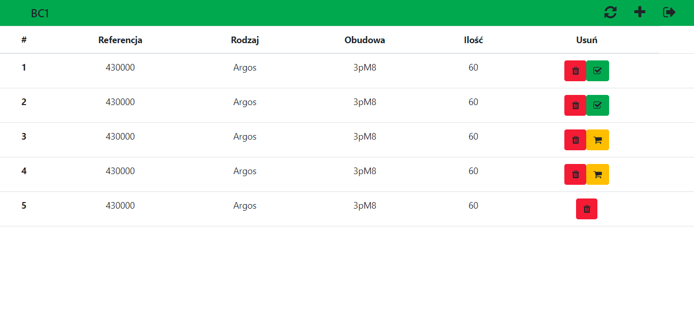
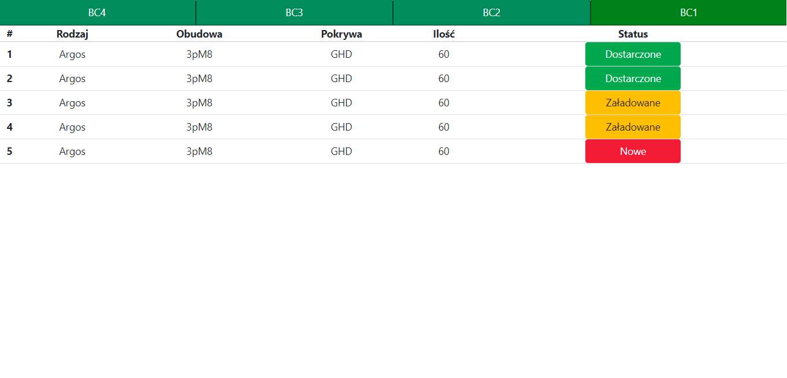

# WarehouseApp
My #2 project.

## Table of contents
* [General info](#general-info)
* [Screenshots](#screenshots)
* [Technologies](#technologies)
* [Setup](#setup)

## General info
Warehouse app helps with delivery parts to production.
Production can orders new parts and warehouse get orders.

## Screenshots
* Production

* Warehouse

## Technologies
* ASP.NET Core API.
* Angular.
* SQL Server.

## Setup
To run API open Warehouse.API.sln with Visual Studio, change from IIS Express to Warehouse.API and press F5.

To run SPA open Warehouse folder with Visual Studio Code and 
`cd Warehouse-SPA` 
`npm install`
`ng serve`

Open http://localhost:4200

Passwords:

* Production:
 bc1/bc1

* Warehouse:
 mag/mag

Example reference to add: 430000
